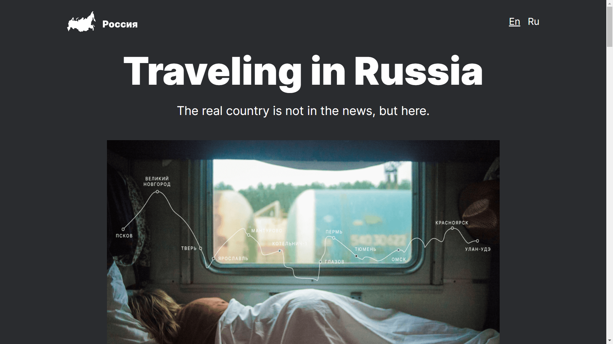
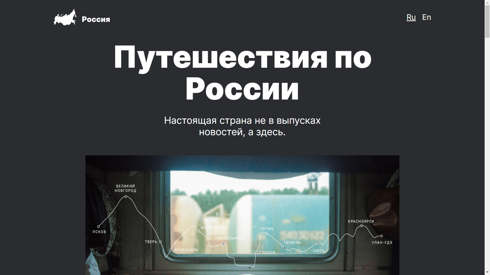
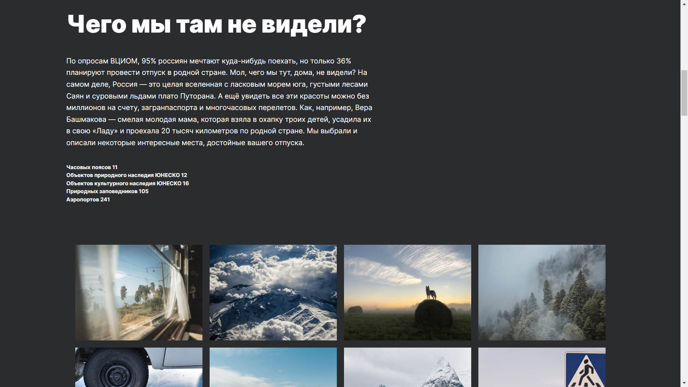
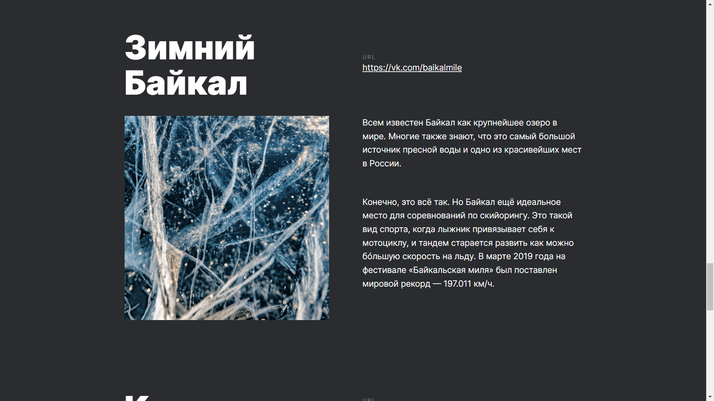
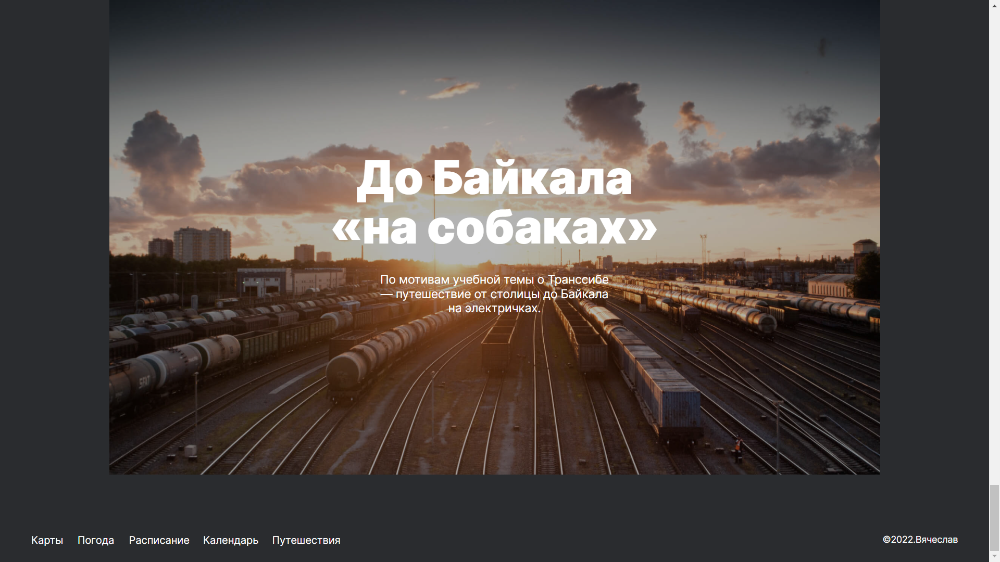
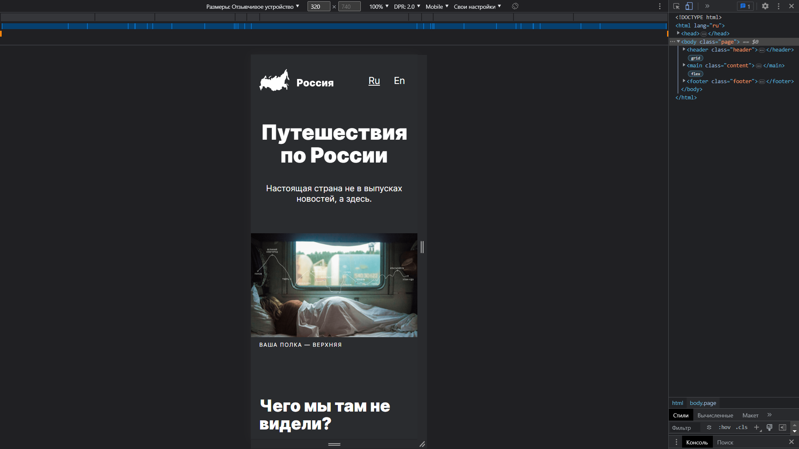

# Проект: Путешествие по России

## Описание проекта 

Сей славный проект, рассказывает и показывает такое количество потрясающих, завораживающих и интеерсных мест, что вам и не снилось. 

## Технологический стек

- HTML, 
- CSS, 
- Flex, 
- Grid layout,
- БЭМ;

На этом проекте я учился применять grid и адаптировать сайт под разные устройства.

------ 
## Пердпросмотр

  

  

  

  

  

  

------ 
## Установка и запуск:

Чтобы запустить этот проект можно просто перейти по ссылке [GithubPage](http://chernoslava.github.io/russian-travel/)

Чтобы запустить локально нужно на локальном компьютере выполнить команду: 
- `git clone https://github.com/ChernoSlava/russian-travel` - Для копирования проекта на локальный пк по https;

После этого можно работать через dev server или два раза кликнуть на index.html этого проекта. 
------ 

## Ссылки на другие проекты
### Проекты созданные при обучении Яндекс.Практикум:

1) [Статичный сайт Путешествие по России](https://github.com/ChernoSlava/Russian-travel);
2) [Репозиторий проекта Место на чистом js](https://github.com/ChernoSlava/Mesto);
3) [Репозиторий полноценного доработанного проекта Место Frontend и Backend](https://github.com/ChernoSlava/react-mesto-api-full);
4) [Дипломный проект Movies explorer](https://github.com/ChernoSlava/movies-explorer-frontend).

### Проекты созданные при обучении и менторстве senior web developer Абретова А.:

1) [Counter](https://github.com/ChernoSlava/counter);
2) [Counter-temperature](https://github.com/ChernoSlava/counter-temperature);
3) [ToDo list](https://github.com/ChernoSlava/ToDo);
4) [Contacts keeper](https://github.com/ChernoSlava/contacts-keeper);
4) [Fish gallery](https://github.com/ChernoSlava/fish-gallery);
5) [Рефакторинг дипломного проекта Movies explorer](https://github.com/ChernoSlava/Movies-exlorer-refactor).

### Проекты с использованием разных технологий:

1) [Dihitals clock с использование SCSS/jQuery](https://github.com/ChernoSlava/Digital-Clock.git);
2) [Films review с использование PUG/SCSS](https://github.com/ChernoSlava/Film-Review);
3) [2d игра на Vanila JavaScript/Canvas](https://github.com/ChernoSlava/Fluppy);
4) [Сайт по продаже бургеров React/Next js](https://github.com/ChernoSlava/Burgers-Next-JS).
